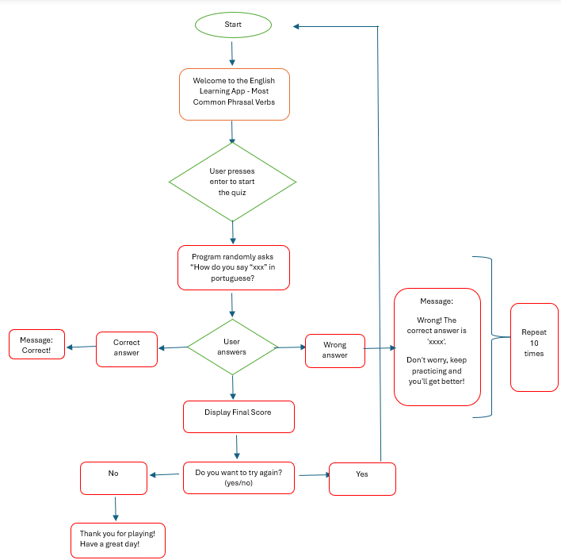
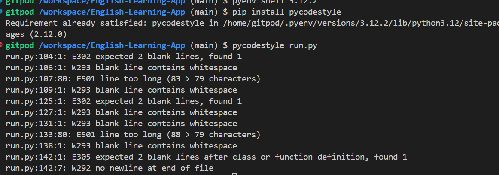

<h1 style="color:blue;">English Learning App - Most Common Phrasal Verbs</h1>

Welcome to the English Learning App! 

Our goal is to help you master the most common phrasal verbs in English by providing a fun and interactive quiz. Whether you're a beginner or looking to refresh your memory, this app is designed to boost your vocabulary skills effectively.

## User Experience (UX)

User Requirements and Expectations

User Requirements: 

The primary user requirement is the desire to improve english vocabulary while playing in a fun and educational activity. The game is suitable for both beginners and advanced students seeking to enhance their vocabulary.

User Expectations- Users can expect:
- Interactive Quiz: Engage with a random selection of phrasal verbs each time you take the quiz.
- Immediate Feedback: Know right away if your answer is correct and see the correct answer if you make a mistake.
- Unlimited Retakes: Practice as many times as you like to improve your knowledge and confidence.
- Score Tracking: Keep track of your progress with a score at the end of each quiz.
- Users interested in programming can explore the codebase to understand the integration of codes.

User Stories

1) First Time Visitor Goals

As a first-time visitor, I want to understand how to play the game and learn about its purpose in relation to english vocabulary.

I aim to experience an engaging and interactive interface that guides me through the gameplay process.

2) Returning Visitor Goals

As a returning visitor, I want to challenge myself with new rounds of the game and improve my score in different medical term categories.

I wish to continue enjoying the entertaining aspect of the game while reinforcing my english vocabulary.

I look forward to comparing my current highscore with my previous ones and with scores from other players.

3. Frequent Visitor Goals

As a frequent visitor, I want to explore all the available categories and consistently achieve higher scores.

I aim to share my progress and achievements with friends and colleagues, promoting healthy competition among fellow players.

## Flow Chart

## Features
## How to Use
1. Start the Quiz: Press enter to begin.
2. Answer Questions: Translate the given phrasal verb from English to Portuguese.
3. Receive Feedback: Get immediate feedback on your answers.
4. View Your Score: At the end of the quiz, see how well you did.
5. Retake the Quiz: Choose to retake the quiz if you want more practice.

## Examples

## Testing

- Tested invalid inputs
- Tested the HEROKU link on Chrome 

## Validator Testing

PEP8
- Errors returned from PEP8 validation. The erros were corrected.

## Bugs

No Bugs were detected

## Deployment
This project was deployed using Code Institute mock terminal for HEROKU.

## Credits
## Content

•	The phrasal verbs and their translations were given by Chatgbt website 
[ChatGbt](https://chatgbt.com/)

## Technologies Used

The primary language employed in this project is Python. 

Frameworks, Libraries & Programs Used:

•	Random - Used to randomly select the word for the game.

•	GitPod - IDE used to create the game.

•	Github - Used for file storage, version control, and hosting page assets.

•	Code Institute Python Essentials Template - Served as the foundational structure for this project.

•	Heroku - Used to deploy the project.

•	Favicon.io - To create favicon.

•	Chat-GPT - To find the most comom english phrasal verbs and their translation to portuguese.

## Acknowledgments

[Code Institute](https://codeinstitute.net/ie/)

•	My project facilitator: Lewis Dillon [Git Hub](https://github.com/LewisDillon)

•	My family for all the support and love

Happy learning!