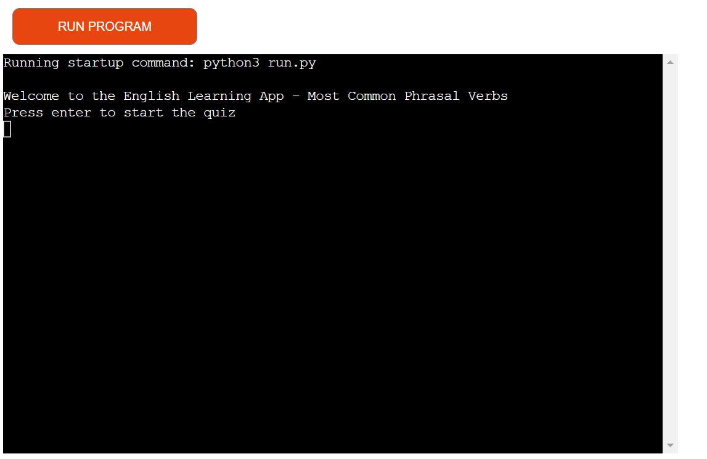
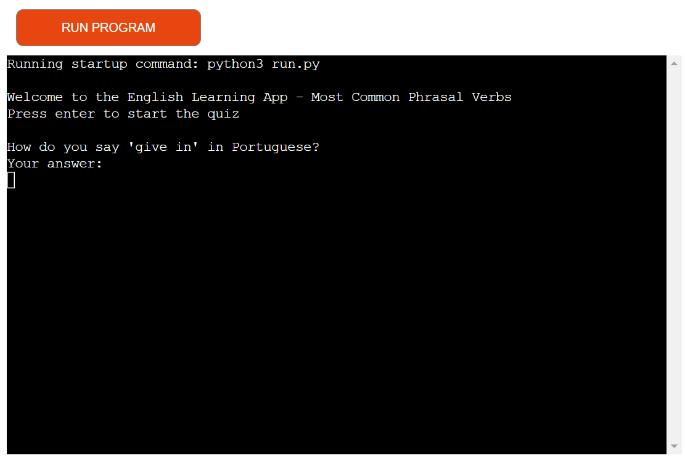
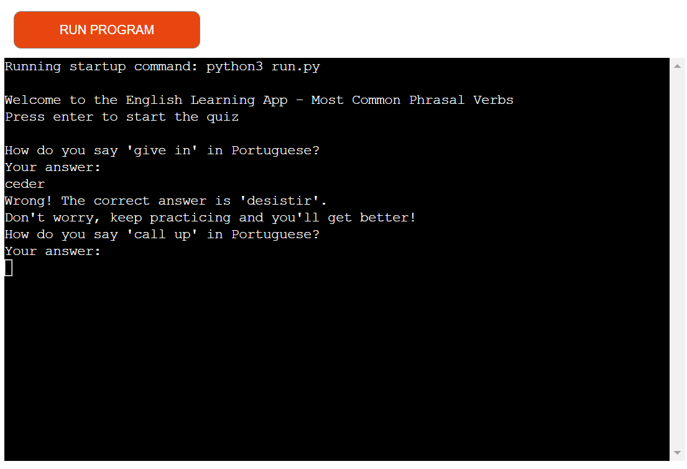
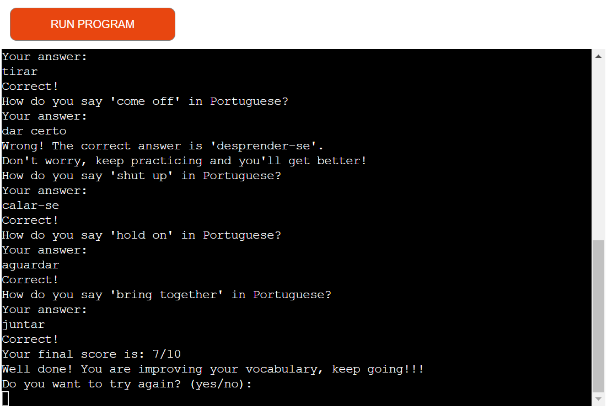
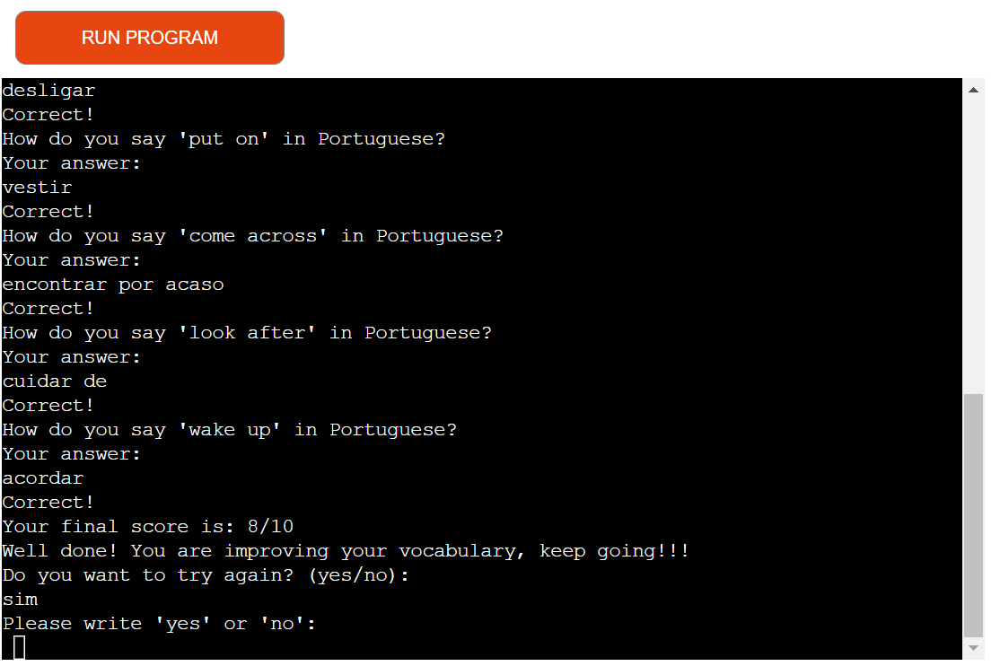
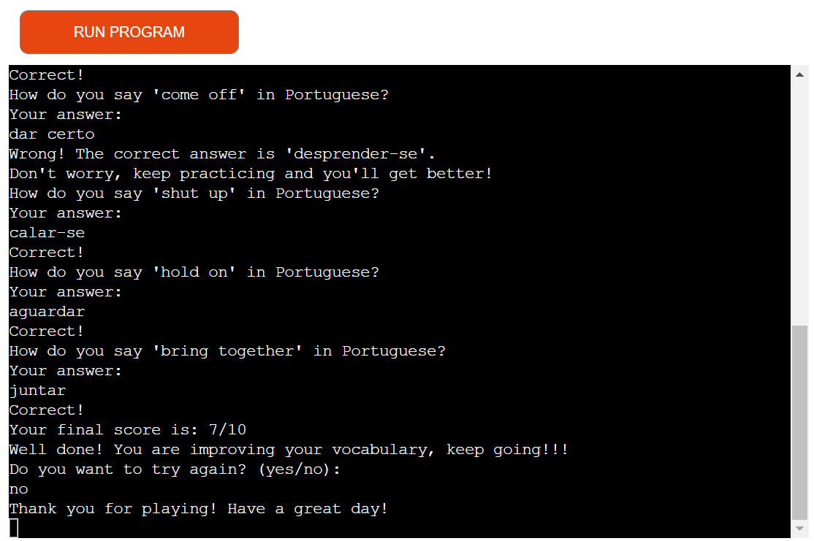
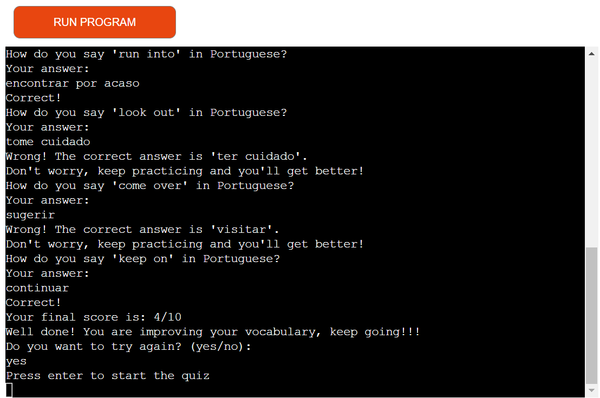
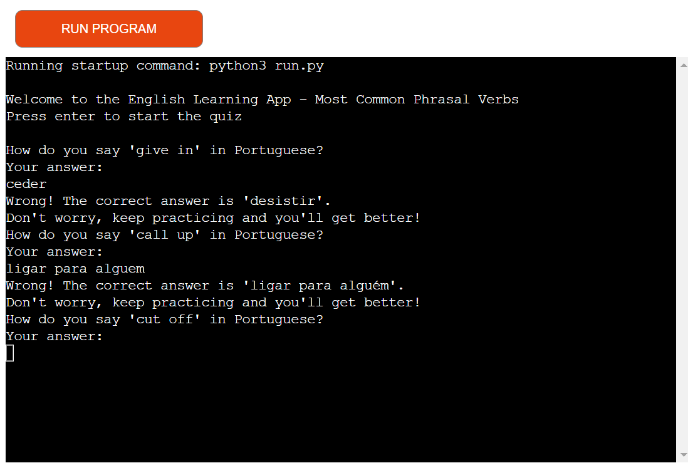

<h1 style="color:blue;">English Learning App - Most Common Phrasal Verbs</h1>

Welcome to the English Learning App! 

Our goal is to help you master the most common phrasal verbs in English by providing a fun and interactive quiz. Whether you're a beginner or looking to refresh your memory, this app is designed to boost your vocabulary skills effectively.

## User Experience (UX)

User Requirements and Expectations

User Requirements: 

The primary user requirement is the desire to improve english vocabulary while playing in a fun and educational activity. The game is suitable for both beginners and advanced students seeking to enhance their vocabulary.

User Expectations- Users can expect:
- Interactive Quiz: Engage with a random selection of phrasal verbs each time you take the quiz.
- Immediate Feedback: Know right away if your answer is correct and see the correct answer if you make a mistake.
- Unlimited Retakes: Practice as many times as you like to improve your knowledge and confidence.
- Score Tracking: Keep track of your progress with a score at the end of each quiz.
- Users interested in programming can explore the codebase to understand the integration of codes.

User Stories

1) First Time Visitor Goals

As a first-time visitor, I want to understand how to play the game and learn about its purpose in relation to english vocabulary.

I aim to experience an engaging and interactive interface that guides me through the gameplay process.

2) Returning Visitor Goals

As a returning visitor, I want to challenge myself with new rounds of the game and improve my score in different medical term categories.

I wish to continue enjoying the entertaining aspect of the game while reinforcing my english vocabulary.

I look forward to comparing my current highscore with my previous ones and with scores from other players.

3. Frequent Visitor Goals

As a frequent visitor, I want to explore all the available categories and consistently achieve higher scores.

I aim to share my progress and achievements with friends and colleagues, promoting healthy competition among fellow players.

## Flow Chart

## Features
## How to Use
1. Start the Quiz: Press enter to begin.
2. Answer Questions: Translate the given phrasal verb from English to Portuguese.
3. Receive Feedback: Get immediate feedback on your answers.
4. The program will repeat the questions 10 times
5. View Your Score: At the end of the quiz, see how well you did.
6. Retake the Quiz: Choose to retake the quiz if you want more practice.

Wecome message

First Question

Wrong Answer Message

Correct Answer Message

Final Score and question to play the game again

No, I don´t want to continue playing the game

Yes, I want to continue playing the game

Answer different to Yes/No

## Responsiviness

## Testing

1) Tested the HEROKU link on Chrome.

2) Manual testing- overview of the testing process and outcomes:

Quiz Flow: The quiz started when users pressed "Enter" as prompted. It presented 10 random phrasal verbs, and answers were checked correctly for accuracy.

Retry Feature: After completing a quiz, selecting “yes” restarted the quiz with a new set of questions, while selecting "no" allowed the program to exit smoothly.

Invalid Input for Retry: The app was tested with incorrect inputs in the retry prompt (e.g., "yep" or "nah"), and it successfully re-prompted users to enter a valid response ("yes" or "no").

Tester answered all questions correctly in one quiz session to check if the score displayed 10/10. Similarly, a few questions were intentionally answered incorrectly to verify that the score accurately reflected the correct and incorrect answers.

Incorrect answers were tested to ensure that the app provided the correct answer and encouraged the user to keep practicing.

The quiz was run multiple times to verify that a variety of phrasal verbs were presented, confirming that the random.shuffle() function worked as intended and minimized repeated questions within the same session.

Tester confirmed that the app displayed a final message summarizing the score after each quiz session, which worked consistently regardless of the number of correct answers.

These tests helped ensure a smooth user experience, verified functionality, and resolved any issues that arose during development.

## Validator Testing

PEP8
- Errors returned from PEP8 validation. The erros were corrected.

## Bugs

1) Solved Bugs

- Accidental Repetition of Phrasal Verbs:

Issue: The quiz sometimes repeated the same phrasal verbs within a single session, reducing variety and learning effectiveness.

Solution: Implemented random.shuffle() to better randomize the list and limit the quiz to unique phrasal verbs per session.

- Inconsistent Score Count:

Issue: The score count sometimes displayed inaccurately when users restarted the quiz multiple times within the same session.

Solution: Reset the score to zero at the beginning of each new quiz session to ensure accuracy.

2) Unsolved bugs

- Input Formatting

Users must provide exact matches for answers. Any additional spaces, incorrect casing, or small typos (like accents) will result in an incorrect answer. A future improvement could include more flexible input validation.

- Quiz Randomization:

The quiz selects verbs randomly but may repeat verbs if restarted. Adding a feature to track verbs previously used in a session or across sessions could reduce repetition.

- User Flow:

The app will continue looping until the user types "no" in the retry prompt. It only accepts "yes" or "no," which might be confusing if the user inputs anything else. A case-insensitive comparison with better handling for typos could improve usability.

- Accents and Special Characters:

Currently, answers with missing or incorrect accents (e.g., "convidar para sair" without the accent on “sair”) will be marked wrong. Future versions might improve input handling to consider correct answers with or without accents.

## Deployment
This project was deployed using Code Institute mock terminal for HEROKU.

Deployment process
1) GitHub Setup

Log in to Github

Access the repository for deployment. 

Add a new line character at the  end of the text inside the input method.

To create a list of requirements, the following command was used in the terminal 'Pip3 freeze > requirements.txt'.

2) Heroku Setup

Log in to Heroku.

Click the "New" button in the top right corner.

Select "Create New App."

Provide a name for the app (english-learning-app) and choose a region (Europe).

Click the "Create app" button.

Navigate to the "Deploy" section in the navigation bar. Under "Deployment Method," choose GitHub/Connect to GitHub.

In the "Connect to GitHub" section, enter the repository name and click the search button.

Once the repository link appears in the search results, click the "Connect" button. 

Go to Settings in the nav bar and select "Add Buildpacks."

Add Python and save. Then add Node.js, ensuring that Python is listed first. Buildpacks

Once the Config Vars are set, click Deploy.

Choose Automatic deployment. Automatic deployment updates the site automatically with your GitHub commits. Ensure that "Branch to deploy" is set to the main branch.

Finally, click the "Deploy" button to make the website go live.

[English Learning App](https://english-learning-app-d0710ebd4b97.herokuapp.com)

## Credits
## Content

•	The phrasal verbs and their translations were given by Chatgbt website 
[ChatGbt](https://chatgbt.com/)

## Technologies Used

The primary language employed in this project is Python. 

Frameworks, Libraries & Programs Used:

•	Random - Used to randomly select the word for the game.

•	GitPod - IDE used to create the game.

•	Github - Used for file storage, version control, and hosting page assets.

•	Code Institute Python Essentials Template - Served as the foundational structure for this project.

•	Heroku - Used to deploy the project.

•	Chat-GPT - To find the most common english phrasal verbs and their translation to portuguese.

## Acknowledgments

[Code Institute](https://codeinstitute.net/ie/)

•	My project facilitator: Lewis Dillon [Git Hub](https://github.com/LewisDillon)

•	My family for all the support and love

Happy learning!